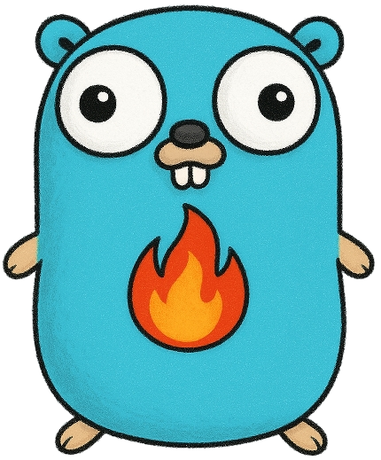

<h1 align="center"><br />🔥 BlazeSub</h1>

<p align="center">
  <a href="https://pkg.go.dev/github.com/NSXBet/blazesub"></a>
  <a href="https://github.com/NSXBet/blazesub/blob/main/LICENSE"></a>
  <a href="https://github.com/NSXBet/blazesub/blob/main/go.mod"></a>
</p>

BlazeSub is a high-performance, lock-free publish/subscribe system designed to outperform traditional MQTT brokers. It provides efficient message routing with support for wildcard subscriptions while maintaining thread safety through lock-free data structures.

## ✨ Features

- **⚡ Ultra-fast performance**: Up to [84.7 million messages per second delivered to 1000 subscribers](PERFORMANCE.md)
- **🧠 Zero memory allocations**: Core operations don't allocate memory, reducing GC pressure
- **🔒 Thread-safe by design**: Uses lock-free data structures for maximum concurrency
- **🌳 MQTT-compatible topic matching**: Supports single-level (+) and multi-level (#) wildcards
- **🚀 Efficient topic caching**: Optimizes repeat accesses to common topics
- **🔄 Flexible message delivery**: Choose between worker pool or direct goroutines for optimal performance
- **⏱️ Low-latency message delivery**: Direct goroutines up to 52% faster than worker pool and 34% faster than MQTT
- **📦 Rich metadata support**: Attach arbitrary metadata to messages for enhanced application context
- **🧩 Generic message types**: Define your own message data types without serialization/deserialization overhead

## 📊 Performance Highlights

- **💯 Direct match throughput**: 84.7 million messages per second to 1000 subscribers
- **🔍 Wildcard match throughput**: 83.5 million messages per second to 1000 subscribers
- **📉 Memory efficiency**: Uses up to 95% less memory than MochiMQTT
- **0️⃣ Zero allocations** for core subscription matching operations
- **🗑️ Minimal GC impact**: Only 2 allocations per publish operation

## 📘 Documentation

- [**API Reference**](https://pkg.go.dev/github.com/NSXBet/blazesub) - Complete API documentation on pkg.go.dev
- [**User Guide**](USER_GUIDE.md) - Comprehensive guide for using BlazeSub
- [**Performance Analysis**](PERFORMANCE.md) - Detailed performance metrics and comparisons
- [**MaxConcurrentSubscriptions Guide**](USER_GUIDE_MAX_CONCURRENT_SUBS.md) - Optimizing message delivery to multiple subscribers

> **Note**: BlazeSub is currently transitioning to generic types for message data. The examples in this README show the new generic API, while some internal components and tests are still being updated. Refer to the [examples section on pkg.go.dev](https://pkg.go.dev/github.com/NSXBet/blazesub#pkg-examples) for the most up-to-date usage patterns.

## 📝 Quick Start

### With basic []byte messages

```go
// Create a new bus with defaults ([]byte for the message)
bus, err := blazesub.NewBusWithDefaults()
if err != nil {
    log.Fatal(err)
}
defer bus.Close()

// Subscribe to a topic
subscription, err := bus.Subscribe("sensors/temperature")
if err != nil {
    log.Fatal(err)
}

// Handle messages
subscription.OnMessage(blazesub.MessageHandlerFunc[[]byte](func(msg *blazesub.Message[[]byte]) error {
    fmt.Printf("Received: %s\n", string(msg.Data))

    // Access metadata (if any)
    if msg.Metadata != nil {
        if unit, ok := msg.Metadata["unit"].(string); ok {
            fmt.Printf("Unit: %s\n", unit)
        }
    }

    return nil
}))

// Publish to a topic (with metadata)
metadata := map[string]any{
    "unit": "celsius",
    "device_id": "thermostat-living-room",
}
bus.Publish("sensors/temperature", []byte("25.5"), metadata)

// When done
subscription.Unsubscribe()
```

### With custom message types

```go
// Define your custom message type
type SensorReading struct {
    Value       float64   `json:"value"`
    Unit        string    `json:"unit"`
    DeviceID    string    `json:"device_id"`
    Timestamp   time.Time `json:"timestamp"`
}

// Create a bus with your custom type
bus, err := blazesub.NewBusWithDefaultsOf[SensorReading]()
if err != nil {
    log.Fatal(err)
}
defer bus.Close()

// Subscribe and handle typed messages directly
subscription, err := bus.Subscribe("sensors/temperature")
if err != nil {
    log.Fatal(err)
}

subscription.OnMessage(blazesub.MessageHandlerFunc[SensorReading](func(msg *blazesub.Message[SensorReading]) error {
    // Direct access to structured data!
    reading := msg.Data
    fmt.Printf("Device %s reports %.1f %s at %s\n",
        reading.DeviceID, reading.Value, reading.Unit, reading.Timestamp.Format(time.RFC3339))
    return nil
}))

// Publish structured data directly
bus.Publish("sensors/temperature", SensorReading{
    Value:     22.5,
    Unit:      "celsius",
    DeviceID:  "thermostat-living-room",
    Timestamp: time.Now(),
})
```

For optimal performance, consider using direct goroutines:

```go
config := blazesub.Config{
    UseGoroutinePool: false,  // Use direct goroutines for max performance
    MaxConcurrentSubscriptions: 50,  // Optimal for most workloads
}
bus, err := blazesub.NewBus(config)
```

For more examples demonstrating different configurations and usage patterns, see the [Examples section on pkg.go.dev](https://pkg.go.dev/github.com/NSXBet/blazesub#pkg-examples).

## 🔧 Key Configuration Options

| Option                     | Purpose           | Recommendation                                 |
| -------------------------- | ----------------- | ---------------------------------------------- |
| UseGoroutinePool           | Delivery mode     | `false` for speed, `true` for resource control |
| MaxConcurrentSubscriptions | Delivery batching | Keep below your subscriber count               |

See the [User Guide](USER_GUIDE.md) for detailed configuration information.

## 🚀 Releasing New Versions

BlazeSub uses [GoReleaser](https://goreleaser.com/) for streamlined releases. To create a new release:

1. **Update Version**: Update documentation and code with the new version
2. **Create Tag**:
   ```bash
   git tag -a v0.x.y -m "Release v0.x.y"
   git push origin v0.x.y
   ```
3. **Automatic Release**: GitHub Actions will automatically:
   - Build and validate the release
   - Generate documentation archive
   - Create GitHub release with release notes
   - Update pkg.go.dev

## 📄 License

MIT License

Copyright (c) 2023 BlazeSub Contributors

Permission is hereby granted, free of charge, to any person obtaining a copy
of this software and associated documentation files (the "Software"), to deal
in the Software without restriction, including without limitation the rights
to use, copy, modify, merge, publish, distribute, sublicense, and/or sell
copies of the Software, and to permit persons to whom the Software is
furnished to do so, subject to the following conditions:

The above copyright notice and this permission notice shall be included in all
copies or substantial portions of the Software.

THE SOFTWARE IS PROVIDED "AS IS", WITHOUT WARRANTY OF ANY KIND, EXPRESS OR
IMPLIED, INCLUDING BUT NOT LIMITED TO THE WARRANTIES OF MERCHANTABILITY,
FITNESS FOR A PARTICULAR PURPOSE AND NONINFRINGEMENT. IN NO EVENT SHALL THE
AUTHORS OR COPYRIGHT HOLDERS BE LIABLE FOR ANY CLAIM, DAMAGES OR OTHER
LIABILITY, WHETHER IN AN ACTION OF CONTRACT, TORT OR OTHERWISE, ARISING FROM,
OUT OF OR IN CONNECTION WITH THE SOFTWARE OR THE USE OR OTHER DEALINGS IN THE
SOFTWARE.
